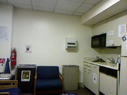
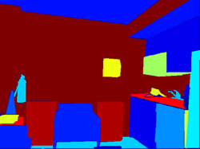
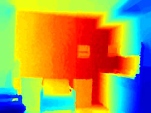

{: .notice}

<h1>Scope</h1>
The RAS TC on Computer and Robot Vision aims to to bring together researchers with common interests in computer and robot vision. We aim to be a forum for ideas relevant to the use of vision and range sensors and issues related to robot perception. Improvement in robot perception is crucial for enhancing robot's autonomy and capability of carrying out more complex tasks. The committee is part of the IEEE Robotics and Automation Society. The mission of the committee involves promoting algorithms for enabling different perceptual capabilities, supporting evaluation and benchmarking and innovative applications. The scope of the committee extends to the use of omnidirectional and RGB-D cameras and new visual sensors.
<figure class="third">
	
	
	
</figure>

<h2>Priority Areas for the Technical Committee include the Use of Visual Sensing for</h2>
<ul>
<li>localization and mapping</li>
<li>vision based control</li>
<li>object detection, segmentation and categorization</li>
<li>semantic scene understanding and categorization</li>
<li>perceptual strategies for human robot interaction</li>
<li>robustness and generalization of the developed algorithms to a variety of conditions and environments</li>
<li>development of real-time and efficient solutions for relevant application areas</li>
</ul>

